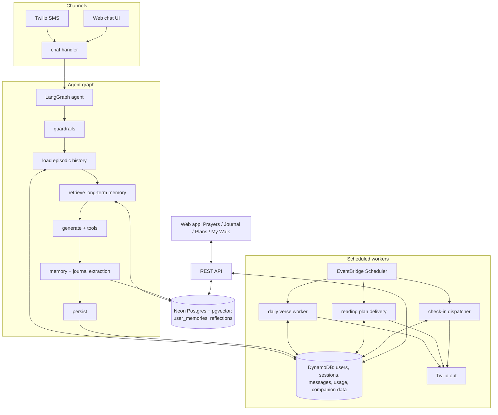
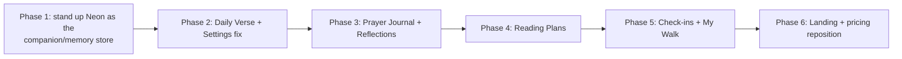

# Versiful Companion — Product & Engineering Spec

> Status: Draft for review
> Theme: Evolve Versiful from a stateless "verse + reflection" bot into a **Bible companion that remembers you**.
> Foundation: a **hybrid data architecture** — keep **DynamoDB** as the system of record for nearly everything (operational data + new companion features), and add a **minimal Neon (Postgres + pgvector)** store that holds only the two things we want to RAG/vector‑search: `user_memories` and `reflections`. No migration, no cutover, no backfill. This unlocks long‑term memory, prayer/reflection journaling, reading plans, daily verses, proactive check‑ins, and a journey view.

---

## Table of Contents

1. [Why we're doing this](#1-why-were-doing-this)
2. [Scope (what's in / out)](#2-scope)
3. [Architecture overview](#3-architecture-overview)
4. [Data model (hybrid: DynamoDB + Neon)](#4-data-model-hybrid-dynamodb--neon)
5. [The memory system](#5-the-memory-system)
6. [Feature: Daily Verse](#6-feature-daily-verse)
7. [Feature: Prayer Journal](#7-feature-prayer-journal)
8. [Feature: Reflection Log](#8-feature-reflection-log)
9. [Feature: Reading Plans](#9-feature-reading-plans)
10. [Feature: Check-ins](#10-feature-check-ins)
11. [Feature: Journey View ("My Walk")](#11-feature-journey-view-my-walk)
12. [Settings & Communication Preferences (fixes)](#12-settings--communication-preferences)
13. [Landing page reposition](#13-landing-page-reposition)
14. [API surface](#14-api-surface)
15. [Infra & scheduled jobs](#15-infra--scheduled-jobs)
16. [Free vs Premium gating](#16-free-vs-premium-gating)
17. [Phasing / rollout](#17-phasing--rollout)
18. [Open questions](#18-open-questions)

---

## 1. Why we're doing this

Today the product is essentially: *describe a situation → get a verse + short reflection*. That's easy to replicate (ChatGPT, YouVersion, a pastor's text thread), there's no habit loop, and every conversation starts from zero. The agent (`lambdas/chat/agent_service.py`) is a single LangChain chain with **one** tool (`get_versiful_info`) and a 10‑message context window. "Memory" is just the last 20 chat messages re‑loaded from DynamoDB each turn.

The companion thesis: **the moat is relationship.** A product that remembers your dad's surgery, the anxiety you keep returning to, the prayers you've asked for, and the plan you're working through — and proactively walks with you — is worth a subscription and brings people back daily.

The unlock is a small, focused addition rather than a rebuild: keep DynamoDB doing what it already does well (cheap, durable operational storage) and add a **minimal Neon (Postgres + pgvector)** store for the one thing DynamoDB can't do — semantic recall over what the user has told us. Structured long‑term memory and reflections live in Neon (vector‑searchable); everything else — users, usage, chat history, and the new companion features (prayers, verse history, reading plans, check-ins) — stays in DynamoDB. The legacy phone‑number `Scan` on every unregistered SMS is fixed in place with a DynamoDB GSI (see §5.1), not a migration.

---

## 2. Scope

**In scope**
- Add a **minimal Neon (Postgres + pgvector)** store for `user_memories` + `reflections` (the only RAG/vector‑searchable data). DynamoDB stays the system of record for everything else — no migration of existing tables.
- Long‑term structured **memory** + **verse history** (for relevance + non‑duplication).
- **Daily Verse** (personalized, non‑duplicative) + fix Settings persistence.
- **Prayer Journal**, **Reflection Log**, **Reading Plans** (full specs below).
- **Check-ins** (proactive, consent‑gated) and **Journey View**.
- **Landing page** reposition to sell the companion value.
- Wire up the existing-but-dead `CommunicationPreferences.jsx`.

**Explicitly out of scope (per direction)**
- Verified scripture API / RAG over a verse corpus. (Verses continue to come from the model. We still store *references* for dedup/relevance.)
- Referral / ambassador program.
- Church / B2B tier.

---

## 3. Architecture overview



Two stores, one stable join key. The agent **loads episodic history from DynamoDB** (verbatim recent messages, exactly as today) and **retrieves long‑term memory from Neon** (vector + structured recall over `user_memories` / `reflections`). Companion feature data — prayers, `verse_history`, reading plans, and check-ins — lives in DynamoDB. `user_id` (the Cognito `sub`) is the stable cross‑store join key; there is **no FK enforcement across stores**, app‑level joins on `user_id` are fine.

Key change to the agent: move from the single `RunnablePassthrough | llm.bind_tools(...)` chain in `agent_service.py` to a **LangGraph `StateGraph`** with explicit nodes for history loading (DynamoDB), memory retrieval (Neon), and post‑turn extraction, plus an expanded tool set. We **skip the LangGraph Postgres checkpointer** — graph state is reconstructed each turn from the DynamoDB history load + the Neon memory retrieval, keeping the persistence model explicit and avoiding coupling thread state to Neon. The agent should **degrade gracefully** if Neon is briefly unavailable: still answer from episodic history, just without long‑term recall.

---

## 4. Data model (hybrid: DynamoDB + Neon)

The architecture is **hybrid by design**: DynamoDB stays the system of record for nearly everything, and Neon holds only the two entities we want to RAG / vector‑search. There is **no migration, no cutover, and no backfill** of existing data — existing DynamoDB tables are untouched, and the new Neon tables start empty and fill organically.

| Store | Holds | Why |
|---|---|---|
| **Neon (Postgres + pgvector)** | `user_memories`, `reflections` | The only data we semantic‑search ("recall what the user told me"). Needs `pgvector` + relational filtering. |
| **DynamoDB (existing)** | `users`, `sms_usage`, `chat_sessions`, `chat_messages`, `promo_codes` | Already the system of record. Cheap, durable, no reason to move it. |
| **DynamoDB (new companion features)** | `prayers`, `verse_history`, `reading_plans`, `reading_plan_days`, `user_reading_plans`, `user_reading_plan_progress`, `checkins` | Cheap key/value + GSI access patterns; no RAG needed. |

`user_id` (the Cognito `sub`) is the stable cross‑store join key. There is **no FK enforcement across stores**; app‑level joins on `user_id` are fine.

### 4.1 Neon tables (the only two)

Postgres on Neon with the `vector` extension enabled. Both tables carry a pgvector `embedding` column so the agent can do semantic recall. Embeddings are produced by an embedding model (e.g. OpenAI `text-embedding-3-small`, 1536‑dim) when a memory/reflection is written (see §5, §15). Use a connection pooler (Neon pooled endpoint or PgBouncer) because Lambda + Postgres needs pooling.

```sql
-- Enable pgvector once per database
CREATE EXTENSION IF NOT EXISTS vector;

-- Long-term structured facts the agent learns about the user
CREATE TABLE user_memories (
    id              UUID PRIMARY KEY DEFAULT gen_random_uuid(),
    user_id         TEXT NOT NULL,    -- Cognito sub; joins to the DynamoDB users item (no FK)
    kind            TEXT NOT NULL,    -- life_event | struggle | relationship | preference | spiritual_state | goal
    summary         TEXT NOT NULL,    -- "Father diagnosed with cancer, surgery scheduled"
    detail          TEXT,             -- optional longer note
    people          JSONB,            -- ["dad"], ["wife Sarah"]
    embedding       vector(1536),     -- OpenAI text-embedding-3-small; powers semantic recall
    salience        REAL NOT NULL DEFAULT 0.5,   -- 0-1, decays/boosts over time
    status          TEXT NOT NULL DEFAULT 'active', -- active | resolved | archived
    source          TEXT,             -- chat | sms | manual | checkin
    source_msg_id   TEXT,             -- DynamoDB chat_messages id, if applicable
    event_date      DATE,             -- if the memory references a date (surgery Thursday)
    created_at      TIMESTAMPTZ NOT NULL DEFAULT now(),
    updated_at      TIMESTAMPTZ NOT NULL DEFAULT now(),
    last_referenced_at TIMESTAMPTZ
);
CREATE INDEX idx_memories_user_active ON user_memories(user_id, status, salience DESC);
CREATE INDEX idx_memories_embedding ON user_memories USING hnsw (embedding vector_cosine_ops);

CREATE TABLE reflections (
    id              UUID PRIMARY KEY DEFAULT gen_random_uuid(),
    user_id         TEXT NOT NULL,    -- Cognito sub; joins to the DynamoDB users item (no FK)
    content         TEXT NOT NULL,    -- the takeaway / journal entry
    embedding       vector(1536),     -- OpenAI text-embedding-3-small; powers semantic recall
    source          TEXT NOT NULL,    -- auto_summary | manual | reading_plan
    session_id      TEXT,             -- DynamoDB chat_sessions session id (no FK)
    verse_reference TEXT,
    mood            TEXT,             -- optional emoji/tag
    created_at      TIMESTAMPTZ NOT NULL DEFAULT now()
);
CREATE INDEX idx_reflections_user ON reflections(user_id, created_at DESC);
CREATE INDEX idx_reflections_embedding ON reflections USING hnsw (embedding vector_cosine_ops);
```

These are the **only** tables that use SQL DDL. Everything else is DynamoDB.

### 4.2 Existing DynamoDB tables (unchanged — system of record)

`users`, `sms_usage`, `chat_sessions`, `chat_messages`, and `promo_codes` keep their current DynamoDB shapes. **No migration, no dual‑write, no schema change** beyond:

- **`users`** gains two things:
  - a **GSI on `phoneNumber`** so the unregistered‑SMS lookup becomes a Query instead of a Scan (see §5.1 — this also fixes a latent correctness bug).
  - the **communication‑preference attributes** described in §4.4 below (these are *not* a new table).
- Companion features write new items into new tables (§4.3); they reference `users` only via `userId`.

### 4.3 New companion DynamoDB tables

These are described as DynamoDB tables (partition key / sort key / GSIs), not SQL. Per‑user item counts are small, so most access is a simple `Query` on the partition key with in‑app filtering.

**`verse_history`** — every verse we've surfaced; powers daily‑verse relevance + non‑duplication.

| Key / Index | Attribute | Notes |
|---|---|---|
| **PK** | `userId` | Cognito sub |
| **SK** | `sentAt` | ISO‑8601 timestamp; sorts most‑recent‑last |
| attrs | `phoneNumber`, `reference`, `displayRef`, `translation`, `themes` (list), `context` (`daily_verse` \| `chat` \| `reading_plan`), `channel`, `sourceMsgId` | `phoneNumber` carried for pre‑registration SMS (verse history before a user has a `userId`) |

> Access pattern: "last N references for this user" → `Query PK=userId` with `ScanIndexForward=false, Limit=N` for daily‑verse dedup. Pre‑registration history can be keyed by `phoneNumber` (either as the PK value or via a `phoneNumber` GSI) and reconciled to `userId` on registration.

**`prayers`** — private, living prayer list.

| Key / Index | Attribute | Notes |
|---|---|---|
| **PK** | `userId` | |
| **SK** | `prayerId` | UUID |
| attrs | `title`, `body`, `category`, `people` (list), `status` (`active` \| `answered` \| `archived`), `answerNote`, `eventDate`, `reminderCadence` (`none` \| `daily` \| `weekly`), `nextReminderAt`, `lastPrayedAt`, `prayCount`, `source`, `createdAt`, `updatedAt`, `answeredAt` | |

> Access pattern: `Query PK=userId` and **filter by `status` in‑app** (per‑user counts are small, so a GSI on status is unnecessary).

**`checkins`** — proactive outreach scheduling + log.

| Key / Index | Attribute | Notes |
|---|---|---|
| **PK** | `userId` | |
| **SK** | `checkinId` | UUID |
| **GSI** (`checkins_by_status`) | **PK** `status`, **SK** `scheduledFor` | time‑based access pattern for the *secondary* (time-sensitive) pass only |
| attrs | `trigger` (`inactivity` for the primary re‑engagement send \| `time_sensitive` for the §10.4 exception), `contextSelector` (`prayer_followup` \| `struggle_followup` \| `plan_nudge` \| `event_followup` \| `general` — which pending context personalized the message, see §10.3), `triggerRef` (prayerId / memory id / userReadingPlanId), `scheduledFor` (ISO; set only for `time_sensitive`), `channel`, `messageSent`, `responseMsgId`, `createdAt`, `sentAt`, `respondedAt` | |

> The `checkins_by_status` GSI serves the **secondary** due-date pass (§10.5 / §10.4): `Query status = 'scheduled' AND scheduledFor <= now` pulls time-sensitive exceptions efficiently. The **primary** inactivity send is *not* driven by this GSI — it's a scan over opted-in users' `lastMessageAt` (§10.6). `checkins` rows for inactivity sends are written as a **log** (with `sentAt`) after the send, not pre-scheduled. The GSI still earns its keep for the capped time-sensitive path.

**Reading plans.** Plan *templates* are largely static catalog data — store them as a small DynamoDB table **or** as seed config shipped with the workers (either is fine; the catalog is tiny and rarely changes). User *enrollment* and *progress* are keyed by `userId`.

| Table | PK | SK | Notes |
|---|---|---|---|
| `reading_plans` (catalog) | `slug` | — | `title`, `description`, `topic`, `dayCount`, `emoji`, `isActive`. Or ship as seed config. |
| `reading_plan_days` (catalog) | `slug` | `dayNumber` | `passageRef`, `theme`, `prompt` |
| `user_reading_plans` | `userId` | `planId` | `status`, `currentDay`, `deliveryChannel`, `deliveryTime`, `lastDeliveredDay`, `lastDeliveredAt`, `startedAt`, `completedAt` |
| `user_reading_plan_progress` | `userId` | `planId#dayNumber` | `completedAt`, `reflectionId` (Neon `reflections.id`) |

> Plan delivery is driven per‑user from the comms‑preference attributes on the `users` item (§4.4) plus `user_reading_plans.deliveryTime`, so no status GSI is required; the worker iterates due users the same way the daily‑verse worker does.

### 4.4 Communication preferences (attributes on the `users` item, not a table)

Comms config is stored as attributes on the existing **`users`** DynamoDB item (wires up the dead `CommunicationPreferences.jsx`). There is **no `communication_preferences` table**. Suggested attributes:

| Attribute | Type | Default | Notes |
|---|---|---|---|
| `primaryChannel` | string | `sms` | `sms` \| `web` |
| `dailyVerseEnabled` | bool | `false` | |
| `dailyVerseTime` | string | `08:00` | local time |
| `dailyVerseChannel` | string | `sms` | |
| `checkinEnabled` | bool | `false` | re‑engagement outreach opt‑in (§10) |
| `checkinFrequency` | string | `weekly` | `off` \| `weekly` \| `biweekly` — hard cap, not a target |
| `checkinInactivityDays` | number | `4` | silence threshold before a re‑engagement send (§10.2) |
| `lastMessageAt` | string | — | denormalized last inbound activity, drives the inactivity scan (§10.6) |
| `readingPlanReminders` | bool | `true` | |
| `marketingUpdates` | bool | `true` | kept separate from spiritual content for TCPA cleanliness |
| `encouragementTips` | bool | `true` | |

Because these are attributes on the user item, reading/writing prefs is the same `GetItem`/`UpdateItem` the app already does for `users` — no extra table or join.

---

## 5. The memory system

This is the heart of the companion, and it spans both stores:

- **Episodic** = `chat_messages` in **DynamoDB** (verbatim, recent window — loaded exactly as today).
- **Semantic / long-term** = `user_memories` + `reflections` in **Neon** (distilled facts and takeaways, vector‑searchable via pgvector).
- **Supporting context** = active `prayers`, `verse_history`, and active `user_reading_plans` — all read from **DynamoDB**.

We **do not** use the LangGraph Postgres checkpointer. Each turn the agent loads history from DynamoDB and retrieves memories from Neon explicitly; this keeps the persistence model legible and means a brief Neon outage degrades gracefully (the agent still answers from episodic history, just without long‑term recall). `user_id` (Cognito sub) is the join key across both stores.

### 5.1 Retrieval (memory_retrieval node)

On each turn, before generating, assemble a compact **companion context** block and prepend it to the system prompt:

```
WHAT YOU REMEMBER ABOUT {first_name}:
- Life: father diagnosed with cancer (surgery was last week) [resolved-pending follow-up]
- Recurring: returns to anxiety about work, especially Sunday nights
- Praying for: mom's surgery (Thu), job interview
- Reading plan: "Finding Peace in Anxiety" — day 3 of 7 (theme: God's provision)
- Prefers: shorter responses, one verse at a time

RECENTLY SHARED VERSES (do NOT repeat unless they ask):
Isaiah 41:10, Philippians 4:6-7, Psalm 23, Matthew 6:34
```

Selection rules (combine cheap deterministic retrieval from DynamoDB with vector recall from Neon):
- Top N active `user_memories` by `salience DESC` (cap ~6) from Neon, optionally re‑ranked by vector similarity to the current message (pgvector is in from day one).
- Active prayers (cap ~5) from DynamoDB, with any near‑term `eventDate` highlighted.
- Active reading plan + current day theme from DynamoDB.
- Last ~30 days of `verse_history.displayRef` (cap ~20) from DynamoDB for the do‑not‑repeat list (`Query PK=userId`, newest first).

> **Decided default (see §18):** **structured/deterministic retrieval is primary** — salience, recency, and status filters carry the weight on every turn. **Vector similarity is secondary**, used mainly for explicit `recall(query)` requests and for fuzzy re-ranking/matching as per-user memory volume grows. pgvector is enabled from day one (because `user_memories` / `reflections` are precisely the data we want to RAG), but it is the upside, not the v1 dependency. Revisit the structured-vs-vector balance as memory volume per user accumulates.

#### Phone-number lookup: GSI, not a Scan (and a latent correctness bug)

Today `lambdas/chat/chat_handler.py` resolves an inbound SMS sender with:

```python
users_table.scan(FilterExpression=Attr('phoneNumber').eq(phone_number), Limit=1)
```

Two problems with this:
1. **Performance at scale:** a `Scan` reads the whole table every unregistered‑SMS turn.
2. **Correctness:** `Limit` on a *filtered* `Scan` applies to the items examined **before** the filter runs, so it can return empty even when the user exists — it only finds them if their record happens to be the first item scanned.

The fix is a **DynamoDB GSI on `phoneNumber`** (turning the Scan into a `Query`), **not** a migration. The GSI Query fixes both the performance‑at‑scale issue and the correctness bug. At the current ~2,000‑user scale this is **low‑urgency** (the Scan costs fractions of a cent), but it's worth doing the next time we touch that code path.

### 5.2 Extraction (memory_extraction node)

After the response, run a cheap GPT‑4o‑mini call that returns structured JSON:

```json
{
  "memories": [{"kind":"struggle","summary":"...","people":[],"event_date":null,"salience":0.7}],
  "prayers":  [{"title":"Mom's surgery","event_date":"2026-06-12","people":["mom"]}],
  "verses":   [{"display_ref":"Isaiah 41:10","themes":["fear","comfort"]}],
  "suggest_checkin": {"time_sensitive": true, "event_date":"2026-06-12", "context":"prayer_followup"}
}
```

- Upsert memories into **Neon `user_memories`** (compute the embedding on write; dedupe by vector similarity / fuzzy match on `summary`; bump `salience` + `last_referenced_at` if it already exists).
- Auto‑create prayers (**DynamoDB `prayers`**) only when the agent *or* user explicitly frames a request as prayer (or via the `save_prayer` tool — preferred, see §7). Avoid silently hoarding.
- Always record `verses` into **DynamoDB `verse_history`** (this is what makes daily verse non‑duplicative).
- Only schedule a **DynamoDB `checkins`** row (`trigger='time_sensitive'`, with `scheduledFor`) when `suggest_checkin.time_sensitive` is true **and** it carries a concrete `event_date` **and** the user's `checkinEnabled` is true (§10.4). Routine, non-dated follow-up items are **not** scheduled as sends — they simply remain candidate context that the inactivity scan can later use to personalize a re-engagement message (§10.2–§10.3). This is the cost guardrail: extraction does not manufacture proactive SMS.

Extraction can run inline (adds ~300-600ms) or be punted to an async invoke to keep SMS latency low. **Recommendation:** async for SMS, inline for web.

### 5.3 New agent tools

Add to the current single‑tool set in `agent_service.py`:

| Tool | Purpose |
|------|---------|
| `get_versiful_info()` | existing |
| `save_prayer(title, body, people, event_date, cadence)` | add to prayer journal |
| `list_active_prayers()` | "what's on my prayer list?" |
| `mark_prayer_answered(prayer_id, note)` | celebrate answered prayer |
| `log_reflection(content, verse_reference)` | save a takeaway |
| `recall(query)` | pull specific older memories/reflections on demand |
| `get_reading_progress()` | where am I in my plan |
| `enroll_reading_plan(slug)` | start a plan from chat |
| `set_daily_verse(enabled, time?)` | turn daily verse on/off; optionally set delivery time (account-management, §5.4) |
| `set_checkin_frequency(level)` | reduce/increase/disable inactivity check-ins (§5.4) |
| `update_bible_version(version)` | change translation (§5.4) |
| `set_response_style(tone?, length?)` | set tone + length (§5.4) |
| `pause_reading_plan()` / `resume_reading_plan()` | control plan delivery (§5.4) |
| `get_account_status()` | read back plan, SMS usage, prefs, prayer/plan snapshot (§5.4) |

### 5.4 Account-management tools

These are ordinary LangChain `@tool` functions registered alongside `get_versiful_info` in `agent_service.py` (**not** MCP tools) — they let a user change their account *by chatting*, in natural language ("turn off my morning verse", "switch me to ESV", "check in on me less often"). Every one of them mutates **attributes on the existing `users` DynamoDB item** — the *same* fields the web Settings page and the §12 communication preferences write. **Chat and web stay in parity by design: both reuse the existing user-update path, so these add NO new REST endpoints and NO new tables.**

| Tool | Behavior | Writes |
|------|----------|--------|
| `set_daily_verse(enabled, time?)` | turn daily verse on/off; optionally set delivery time | `dailyVerseEnabled`, `dailyVerseTime` |
| `set_checkin_frequency(level)` | reduce/increase/disable inactivity check-ins; maps the natural-language level (e.g. `"off"`, `"less often"` → larger inactivity window, `"weekly"`) onto the prefs | `checkinFrequency`, `checkinInactivityDays` |
| `update_bible_version(version)` | change translation (NIV / ESV / KJV / …) | `bibleVersion` |
| `set_response_style(tone?, length?)` | tone (warm / pastoral / concise), length (short / fuller) | `responseStyle` |
| `pause_reading_plan()` / `resume_reading_plan()` | pause or resume plan delivery | `status` on the active `user_reading_plans` item |
| `get_account_status()` | **read-back only:** current plan (free/premium), SMS usage remaining, and current preferences — plus a brief active-prayer count and current reading-plan progress (kept concise) | none (read) |

**Guardrails**
- **Confirm-then-apply + plain-language read-back.** After a mutation the agent confirms what changed in plain language and how to reverse it: *"Done — I'll pause your daily verse; text me anytime to turn it back on."* No silent changes.
- **Billing stays out of chat mutation (safety boundary).** Upgrades and cancellation are **never** performed by these tools. The agent does not touch Stripe directly — for plan changes it returns the **Stripe customer-portal link**, and for cancellation it points to the existing **STOP** path. This keeps money movement out of the agent's reach.
- **TCPA / consent + audit trail.** Turning a message type **off** is always safe. Turning one **on** is permitted because the user already consented to SMS — but **every** preference change is written with an **audit trail** (timestamp + `source=chat`) so we can show who/what/when changed a setting.
- **Single-store + idempotent.** All writes target the `users` DynamoDB item via the existing `UpdateItem` path; the tools are idempotent (re-issuing "turn off daily verse" when it's already off is a no-op that still confirms state).

### 5.5 Backfilling existing users (one-off)

**Goal.** When the memory foundation goes live (Phase 1), backfill existing users' prior conversation history into the memory store (`user_memories` in Neon) so the companion immediately "remembers" longtime users instead of starting cold on their next message.

**Method = replay through the live pipeline.** The backfill **must reuse the exact §5.2 extraction logic the agent runs on new messages** — same extraction prompt, same dedup/upsert, same salience scoring, same embedding model — just applied retroactively. It is **not** a separate or divergent code path. The script reads a user's historical `chat_messages` from **DynamoDB** (by `userId` / `threadId`, in chronological order), batches them, and feeds them through the existing extractor so the resulting memories are **indistinguishable from organically-captured ones**.

**Idempotent / re-runnable.** Because it reuses §5.2's dedup/upsert (vector-similarity + fuzzy `summary` match, bumping `salience` / `last_referenced_at` instead of inserting), re-running the backfill does **not** duplicate memories — a safe property given we may run it more than once while tuning.

**Scale.** Today there are only a handful of users, with effectively **one** user holding substantive history. So this is a simple **one-off batch script** — no streaming/queue/heavy infra needed; iterate users, replay, done.

**Dependency.** Requires a **provisioned Neon project + a supplied `NEON_DATABASE_URL`** (Neon can't be auto-provisioned — see §15.1). It runs **after** the `user_memories` schema and the Neon connection module exist, so the extractor's upsert target is in place.

---

## 6. Feature: Daily Verse

Ship the Premium feature that's already on the pricing page but doesn't exist. The differentiator vs. every other "verse of the day": **it's personalized to the user's life and never repeats.**

### 6.1 User interaction

- **Opt-in** in Settings → Communication Preferences: toggle on, pick a time and channel (SMS default).
- Each morning at the chosen local time, the user gets one message:
  > *Morning, Chris. As you head into your mom's surgery today — "When you pass through the waters, I will be with you." (Isaiah 43:2, NIV). You don't walk in alone today.*
- Replying continues the normal chat thread (the verse becomes conversational).
- A weekly recap (Sunday) summarizes themes: *"This week we sat with patience, hope, and rest."*

### 6.2 How relevance + non-duplication work

The daily verse worker, per due user, builds context from:
- Active `user_memories` (struggles, upcoming `event_date`s).
- Active `prayers` (esp. those with near `event_date`).
- Current reading plan theme.
- Recent `reflections`.
- `verse_history` for the **exclusion list**.

It calls the LLM: *"Choose ONE verse + a 1-2 sentence reflection personalized to this context, in {bible_version}. Do NOT use any of these recently-sent references: {list}."* Result is sent, then written to the `verse_history` DynamoDB table with `context='daily_verse'`. Use the most recent `verse_history` item for the user (a `Query` on `PK=userId`) plus a `lastDailyVerseAt` guard on the `users` item to avoid double-sends.

### 6.3 Backend
- New `daily_verse_worker` Lambda (see §15).
- Reuses `agent_service` verse-selection prompt path; no new tables beyond the `verse_history` DynamoDB table (§4.3) + the comms‑preference attributes on the `users` item (§4.4).

---

## 7. Feature: Prayer Journal

A private, living prayer list the agent participates in — not a static notes app.

### 7.1 Interaction model

**From chat / SMS (agent-driven):**
- User: *"Please pray for my mom, she has surgery Thursday."*
- Agent responds pastorally **and** calls `save_prayer(title="Mom's surgery", people=["mom"], event_date="2026-06-12")`.
- Agent confirms softly: *"I've added your mom's surgery to your prayer list — I'll be praying with you."*
- Later (Friday), a check-in fires: *"How did your mom's surgery go yesterday?"* → if positive, agent offers `mark_prayer_answered`.
- SMS keyword `PRAYERS` → returns active list. (New keyword alongside STOP/START/HELP.)

**From web (`/prayers`):**
- List of prayer cards grouped by **Active** / **Answered**.
- "+ Add prayer" modal: title, optional detail, people, category, optional date, reminder cadence.
- Each card: pray-now button (increments `pray_count`, sets `last_prayed_at`), edit, mark answered.
- Mark answered → modal for an answer note → celebration state + a verse of thanksgiving generated by the agent, logged to `verse_history` + `reflections`.
- Filter by category; search.

### 7.2 UI components (frontend)
- `pages/Prayers.jsx` (route `/prayers`, premium-gated).
- `components/prayers/PrayerList.jsx`, `PrayerCard.jsx`, `AddPrayerModal.jsx`, `AnsweredCelebration.jsx`, `PrayerReminderToggle.jsx`.
- Reuse the warm design system (cream/terracotta/sage, `font-display`/`font-body`, `rounded-4xl`, `shadow-warm`) — match `LandingPage.jsx`.

### 7.3 Backend
- `prayers` DynamoDB table (§4.3).
- `prayers` Lambda + endpoints (§14).
- Agent tools `save_prayer`, `list_active_prayers`, `mark_prayer_answered`.
- Reminders via `next_reminder_at` consumed by the check-in dispatcher.

---

## 8. Feature: Reflection Log

A searchable record of takeaways — the user's spiritual journal, mostly assembled *for* them.

### 8.1 Interaction model
- **Auto-suggested:** after a meaningful exchange, agent offers: *"Want me to save a one-line takeaway from this?"* On web it's a one-tap "Save reflection" button under the assistant message; on SMS the user can reply `SAVE`.
- **Reading-plan reflections:** when a user replies to a plan day's prompt, that reply is stored as a reflection linked to the plan day.
- **Manual:** `/journal` "+ New reflection".
- The agent **references** reflections later: *"A few weeks ago you wrote that you wanted to trust God with the timing — does that still feel true?"* (via `recall`).

### 8.2 UI
- `pages/Journal.jsx` (route `/journal`, premium): reverse-chronological timeline; each entry shows date, content, linked verse, optional mood; search box; filter by source (chat/plan/manual).
- `components/journal/ReflectionTimeline.jsx`, `ReflectionEntry.jsx`, `AddReflectionModal.jsx`.
- "Save reflection" affordance in `Chat.jsx` (small button on assistant bubbles).

### 8.3 Backend
- `reflections` Neon table (§4.1) — embedded on write for semantic recall; `reflections` endpoints; `log_reflection` tool; auto-summary uses GPT-4o-mini.

---

## 9. Feature: Reading Plans

Structured, multi-day journeys that create a daily habit and give the agent context.

### 9.1 Seed catalog (v1)
| Slug | Title | Days | Topic |
|------|-------|------|-------|
| `anxiety-7` | Finding Peace in Anxiety | 7 | anxiety |
| `grief-14` | Walking Through Grief | 14 | grief |
| `new-believer-30` | First Steps with Jesus | 30 | new_believer |
| `forgiveness-7` | The Freedom of Forgiveness | 7 | forgiveness |
| `marriage-14` | Strengthening Your Marriage | 14 | marriage |
| `gratitude-7` | A Heart of Gratitude | 7 | gratitude |
| `hope-10` | Holding On to Hope | 10 | hope |

Each `reading_plan_days` row = a passage + theme + reflection prompt. (Passages are references; text still comes from the model at delivery, consistent with the no-scripture-API decision.)

### 9.2 Interaction model
- **Discover:** `/plans` catalog of cards by topic. Agent can also suggest a plan in chat ("Since anxiety keeps coming up, want to try a 7-day plan on it?") and `enroll_reading_plan`.
- **Daily delivery:** at the user's chosen time, the plan-delivery worker sends day N's passage + a reflection prompt (SMS and/or web). Replying logs a reflection and marks the day complete.
- **Progress:** `/plans/:id` shows day X of N, a checklist, a simple streak, and today's passage. Mark-complete button.
- **Adaptation:** the agent knows the active plan + current day (via memory context) and weaves it into normal conversations.
- **Missed days:** plan_nudge check-in (capped, gentle).

### 9.3 UI
- `pages/Plans.jsx` (catalog), `pages/PlanDetail.jsx` (enrolled progress).
- `components/plans/PlanCard.jsx`, `PlanProgress.jsx`, `PlanDayCard.jsx`, `EnrollButton.jsx`.

### 9.4 Backend
- DynamoDB tables (§4.3): `reading_plans`, `reading_plan_days` (catalog — table or seed config), `user_reading_plans`, `user_reading_plan_progress`.
- `plans` Lambda + endpoints; `reading_plan_delivery` worker; tools `enroll_reading_plan`, `get_reading_progress`.

---

## 10. Feature: Check-ins

Proactive, agent-initiated outreach. This is the highest-retention feature and the hardest to copy — **and the most compliance-sensitive.** It is also the feature most likely to quietly inflate Twilio cost, so the design is **inactivity-driven and cost-conscious by default** (see the cost model in §16.1): we don't push a steady stream of event/prayer follow-ups. The primary job is **re-engagement** — reach out when a user has gone quiet — and we use the user's pending context (prayers, struggles, plan day) only to make that one message relevant, not as independent reasons to send.

### 10.1 Consent & guardrails (must-haves)
- Off by default. Explicit opt-in in Communication Preferences (separate from transactional + marketing consent; this is "spiritual care" outreach).
- Respect `opted_out` / STOP immediately.
- Hard frequency cap from `checkinFrequency` (e.g., max 1/week) regardless of how many triggers exist.
- Quiet hours (no sends outside ~8am-9pm local).
- Every check-in SMS still honors STOP and includes nothing markety.
- **Cost guardrail:** because each send costs money (§16.1), the default posture is *one* re-engagement message after a quiet stretch — not a series of proactive follow-ups. The frequency cap is a ceiling, not a target.

### 10.2 Primary trigger: re-engagement after inactivity
The core send trigger is **silence**: the user opted in, hasn't sent an inbound message for **N days** (configurable per user via `checkinInactivityDays`; default conservative, e.g. **3–4 days**), and hasn't been checked-in-on within a **cooldown window** (respecting the frequency cap, STOP, and quiet hours).

- A scheduled job (the check-in dispatcher, §15.2) finds opted-in users whose `lastMessageAt` is older than their threshold and who are outside their cooldown window.
- When we do reach out, we compose **a single warm message** and select the most relevant pending context to personalize it (see §10.3). We are not sending one message per pending item — we're sending one message, made relevant.
- Reply flows into the normal chat thread, which resets `lastMessageAt` and the cooldown — re-engagement succeeded.

### 10.3 Context selectors (personalize the one message, don't multiply sends)
The old trigger types are **not** independent SMS sends. They are **content selectors** that pick what the single re-engagement message should be about. When the dispatcher decides to reach out (because the user went quiet), it ranks the user's pending context and picks the most pertinent one to personalize the message:

| Selector | Picks the message theme when… | Example framing |
|------|---------|---------|
| `prayer_followup` | a prayer has an `eventDate` that just passed or is near | "How did your mom's surgery go?" |
| `event_followup` | a `user_memories` row has a near/just-passed `event_date` | "Thinking of you before your interview." |
| `struggle_followup` | a recurring struggle is the most salient open item | "Last we talked, anxiety was heavy — how's your heart?" |
| `plan_nudge` | the user has an active reading plan with a missed day | "Your plan's waiting whenever you're ready — no pressure." |
| `general` | nothing specific is pending | "Been a few days — thinking of you. How are you?" |

The dispatcher resolves at most **one** selector per send. Selection priority is roughly: time-sensitive prayer/event date > recurring struggle > plan nudge > general.

### 10.4 Secondary trigger: time-sensitive moments (tightly capped exception)
For genuinely time-sensitive moments — e.g. a prayer/event with `eventDate` **today** ("your mom's surgery is today") — we allow a small, capped exception that can send *without* waiting for inactivity. This is the only path that isn't inactivity-gated, and it is bounded hard:
- Subject to the same opt-in, STOP, quiet hours, and frequency cap.
- Capped to a very small number per period (e.g. ≤1/week) and only for dated items the user explicitly shared.
- Default posture remains inactivity-driven; this exception exists so we don't miss the one moment that matters, not to enable routine event follow-ups.

### 10.5 How it works (dispatcher)
- The **check-in dispatcher** worker runs (e.g., hourly). It does two passes:
  1. **Inactivity scan (primary):** find opted-in users silent ≥ N days and outside cooldown (see §10.6 for how `lastMessageAt` is derived efficiently). For each, pick one context selector (§10.3), generate a warm message from memory context, send, and log a `checkins` row marked `sent`.
  2. **Due-date pass (secondary, capped):** `Query checkins_by_status` for `status='scheduled' AND scheduledFor <= now` to catch the time-sensitive exceptions (§10.4); send within caps + quiet hours.
- During extraction (§5.2), when the agent detects a *dated* time-sensitive item, it may insert a `checkins` row with `scheduledFor` for the §10.4 pass — but routine follow-up items are **not** scheduled as sends; they simply become candidate context the inactivity scan can use later.
- A reply flows into the normal chat thread; the dispatcher matches it back and sets `responded`.

### 10.6 Finding inactive users efficiently
"Silent for N days" is a scan over users' last-activity timestamp, not a per-user time GSI. Derive `lastMessageAt` from the most recent inbound activity (latest `chat_messages` / `chat_sessions` update, or last inbound `sms_usage` event) and **denormalize it onto the `users` item** (`lastMessageAt`) on every inbound turn — a single `UpdateItem` we're already positioned to make in the chat path. The dispatcher then finds candidates by querying opted-in users (`checkinEnabled = true`) and filtering on `lastMessageAt <= now - threshold` and cooldown. At current scale this filter is cheap; if it grows, add a sparse GSI keyed on a coarse `lastActiveBucket` so the scan stays bounded.

### 10.7 UI
- Settings toggle + frequency + inactivity threshold (in Communication Preferences).
- Optional "Upcoming check-ins" preview in My Walk (transparency builds trust).

---

## 11. Feature: Journey View ("My Walk")

A web dashboard that makes the invisible relationship **visible** — this is what justifies the subscription and drives retention. Mostly a read/aggregation layer over the new tables.

### 11.1 Layout (route `/walk`, becomes the post-login home for subscribers)
- **Header:** "Your walk with Versiful" + streak / days active.
- **Themes explored:** chips/tag-cloud from `verse_history.themes` + `user_memories.kind` ("anxiety", "hope", "forgiveness"). Tapping a theme shows related verses/reflections.
- **Prayers:** active count + answered count; answered prayers celebrated; quick link to `/prayers`.
- **Reflections:** count + 2-3 most recent; link to `/journal`.
- **Reading plan:** current plan progress ring; link to `/plans`.
- **Verses received:** count + a few favorites.
- **Milestones timeline:** auto-generated moments ("Started 'Finding Peace in Anxiety'", "Prayer answered: new job", "First reflection saved").
- **Gentle prompts:** "You've explored anxiety and hope a lot. Have you ever sat with gratitude? Try a 7-day plan."
- **Things Versiful remembers (memory controls):** a transparency + control surface listing the structured facts Versiful is holding about the user, with the ability to delete individual items or clear all. See §11.2a.

### 11.2 UI
- `pages/MyWalk.jsx`; `components/walk/ThemeCloud.jsx`, `PrayerSummary.jsx`, `ReflectionSummary.jsx`, `PlanProgressCard.jsx`, `MilestoneTimeline.jsx`, `MemoryManager.jsx`.

### 11.2a "Things Versiful remembers" (memory privacy & controls)
A dedicated panel inside My Walk (rendered by `MemoryManager.jsx`) that makes long-term memory **visible and user-controlled** — a trust pillar and our answer to "right to be forgotten" (GDPR/CCPA). See Appendix A implication #6 (privacy pillar).

- **Lists** the user's `user_memories` (grouped by `kind`: life events, struggles, relationships, preferences, etc.), showing `summary`, `people`, and `event_date` where present. Optionally also surfaces `reflections` (the user's saved takeaways) under a secondary tab.
- **Controls:** delete an individual memory, or **clear all** memories at once. Each delete is explicit and confirmed.
- **Clean single-store deletes:** because `user_memories` and `reflections` live **only** in Neon (DynamoDB never holds them), a deletion is a single-store operation — delete the row and its pgvector `embedding` in one statement, with nothing to reconcile across stores. This makes the privacy story simple and auditable.
- **Endpoints:** `GET /walk/memories`, `DELETE /walk/memories/{id}`, `DELETE /walk/memories` (clear all) — see §14. Deletes must drop the pgvector row (the `embedding` column is on the same row, so a normal row delete removes it; no separate vector cleanup needed).

### 11.3 Backend
- A single `GET /walk/summary` endpoint that aggregates counts + recent items across tables (one Lambda, several queries, cached briefly).
- Memory-control endpoints (`GET/DELETE /walk/memories`, `DELETE /walk/memories/{id}`) read/delete directly from Neon `user_memories` (and `reflections` if exposed); see §14.

---

## 12. Settings & Communication Preferences

### 12.1 Fix the fake save (bug)
`pages/Settings.jsx` `handleSaveChanges` currently just does `setTimeout(1200)` and never calls the API — so Bible version changes (and anything in Personalization) silently don't persist. Wire it to `PUT /users` with the changed fields (`bible_version`, `response_style`, `timezone`, etc.).

### 12.2 Wire up CommunicationPreferences
`components/settings/CommunicationPreferences.jsx` exists but is never imported. Mount it in `Settings.jsx` and back it with the **comms‑preference attributes on the `users` DynamoDB item** (§4.4) — there is **no separate `communication_preferences` table**. `GET/PUT /users/preferences` simply reads/writes those attributes (`dailyVerseEnabled`, `dailyVerseTime`, `checkinEnabled`, `checkinFrequency`, `readingPlanReminders`, `primaryChannel`, etc.) via the existing `users` `GetItem`/`UpdateItem`. Extend it with the companion toggles:
- Primary channel (SMS/Web)
- Daily verse (on/off, time, channel)
- Check-ins (off/weekly/biweekly)
- Reading plan reminders (on/off)
- Marketing updates (on/off) — keep separate from spiritual content for TCPA cleanliness

> **Chat / web parity:** the §5.4 account-management agent tools and this web Settings UI write the **same** `users` attributes via the same user-update path — changing a preference by text (`set_daily_verse`, `set_checkin_frequency`, `update_bible_version`, `set_response_style`) and changing it here are interchangeable, with no separate endpoint or table.

### 12.3 Response style
`response_style` exists in the user model but isn't surfaced. Add a Personalization control: **Tone** (warm friend / pastoral / concise) and **Length** (short / fuller). Inject into the system prompt the same way `bible_version` is injected today.

---

## 13. Landing page reposition

The current hero in `pages/LandingPage.jsx` is "Send a text. Get back a Bible verse. No apps, no distractions." That sells the *old* simple product. Reposition around the companion while keeping the warm aesthetic (cream/terracotta/sage, `font-display`, blobs, `shadow-warm`).

### 13.1 New hero copy (proposed)
- **H1:** "A Bible companion that *remembers you*."
- **Sub:** "Text or chat about whatever you're facing. Versiful responds with Scripture, walks with you through prayer and reading, and checks in when life gets hard."
- Keep the SMS "try it free" primary CTA and "Sign up" secondary.
- Keep social proof bar.

### 13.2 New / revised sections
Replace the generic "What comes back" bullets with companion value:
- **Remembers your story** — "Tell it once. Versiful remembers your dad's surgery, the worry you keep returning to, the prayers you've shared."
- **A verse every morning, made for you** — "Personalized daily encouragement that never repeats and speaks to what you're actually walking through."
- **Your prayer list, prayed with** — "Add prayers by text. We follow up. Celebrate answered prayers together."
- **Guided reading plans** — "7-day to 30-day journeys on anxiety, grief, marriage, hope, and more."
- **Checks in on you** — "A gentle message after a hard day or a big moment you mentioned."
- **See your walk** — "Watch your spiritual journey take shape over time."

### 13.3 Pricing copy reposition
Reframe Premium from "unlimited messages" to **"Your personal Bible companion."** Update `Subscription.jsx` / feature lists: unlimited guidance + memory across conversations + personalized daily verse + prayer journal + reading plans + check-ins + My Walk + full history.

Update `FeaturesPage.jsx` and `HowItWorksPage.jsx` to match.

---

## 14. API surface

New/changed endpoints (all JWT unless noted). Existing auth/users/chat/subscription/sms endpoints stay.

```
# Preferences
GET    /users/preferences
PUT    /users/preferences
PUT    /users                      # FIX: persist bible_version/response_style/timezone

# Prayers
GET    /prayers?status=active|answered
POST   /prayers
PUT    /prayers/{id}
POST   /prayers/{id}/answered      # body: { note }
DELETE /prayers/{id}

# Reflections
GET    /reflections?q=&source=
POST   /reflections
DELETE /reflections/{id}

# Reading plans
GET    /plans                      # catalog (public ok)
GET    /plans/{slug}               # detail (public ok)
POST   /plans/{slug}/enroll
GET    /plans/enrolled             # user's active/past plans + progress
POST   /plans/enrolled/{id}/complete-day   # body: { day_number, reflection? }
POST   /plans/enrolled/{id}/pause

# Journey
GET    /walk/summary

# Memory controls ("Things Versiful remembers" — Neon-only, §11.2a)
GET    /walk/memories                # list user_memories (and optionally reflections)
DELETE /walk/memories/{id}           # delete one memory (drops its pgvector row)
DELETE /walk/memories                # clear all memories for the user

# Daily verse (mostly internal/worker; user config via /users/preferences)
```

SMS keyword additions in `sms_handler.py`: `PRAYERS` (list), `SAVE` (save last reflection), alongside existing STOP/START/HELP.

---

## 15. Infra & scheduled jobs

### 15.1 Neon (small scope)
- Provision **one** small Neon project (prod + dev branches — Neon branching is great for this). Scope is deliberately tiny: only `user_memories` + `reflections`.
- Enable the `vector` extension; create the two tables (§4.1) with their HNSW indexes.
- Connection string in Secrets Manager (extend `secrets_helper.py`).
- Pooling: Neon pooled endpoint or PgBouncer; the chat + worker Lambdas open short-lived pooled connections.
- Migrations: a lightweight schema script (or Alembic) for the two tables — there's no schema tooling today, but the surface is small.
- **No DynamoDB → Neon backfill, no dual‑write, no cutover.** The Neon tables start empty and fill organically as the agent extracts memories/reflections. (This means no *row-copy migration* of operational data. It is **distinct** from the optional one-off **memory backfill** in §5.5, which doesn't copy rows — it replays existing `chat_messages` through the live §5.2 extractor. That backfill depends on a provisioned Neon project + a supplied `NEON_DATABASE_URL`, and runs after the schema/connection module exist.)

### 15.1a Embeddings
- Writing a memory or reflection calls an embedding model (e.g. OpenAI `text-embedding-3-small`, 1536‑dim) to populate the `embedding` column. This is a small new dependency + per‑write cost; batch where possible and tolerate transient failures (store the row, backfill the embedding on retry).

### 15.2 New Lambdas
- `daily_verse_worker` — triggered by EventBridge Scheduler (every 15 min, timezone-bucketed); selects due daily-verse users; sends + records.
- `reading_plan_delivery` — same cadence; delivers due plan days.
- `checkin_dispatcher` — hourly; two passes (§10.5): (1) **inactivity scan** over opted-in users whose `lastMessageAt` is older than `checkinInactivityDays` and outside cooldown → one personalized re-engagement send each; (2) **due-date pass** via `checkins_by_status` for the capped time-sensitive exceptions. Both respect caps + quiet hours + STOP.
- `prayers`, `reflections`, `plans`, `walk`, `preferences` — REST handlers (could be one consolidated companion Lambda to limit cold starts).
- Memory extraction — either inline in `chat` or a small async-invoked `memory_extractor`.

### 15.3 Agent layer
- Add `langgraph` + a Postgres driver (`psycopg` or the Neon serverless driver) to the LangChain Lambda layer (`requirements.txt` is currently missing langgraph despite the docs). **Skip `langgraph-checkpoint-postgres`** — we don't use the Postgres checkpointer (see §3, §5).
- Add the embedding client dependency (e.g. the OpenAI SDK if not already present) for `text-embedding-3-small`.

### 15.4 Terraform
- New Neon secret; EventBridge Scheduler schedules; new Lambda definitions + IAM.
- **DynamoDB stays — no IAM removal, no decommission.** Instead:
  - Add the **`phoneNumber` GSI** on the `users` table (fixes the Scan + correctness bug, §5.1).
  - Add the **`checkins_by_status` GSI** (`PK=status`, `SK=scheduledFor`) for the dispatcher (§4.3).
  - Define the **new companion DynamoDB tables** (`prayers`, `verse_history`, reading‑plan tables, `checkins`) via Terraform.
- Keep VPC considerations minimal (Neon is public + TLS; no VPC needed unless you want PrivateLink).

---

## 16. Free vs Premium gating

| Capability | Free | Premium |
|---|---|---|
| SMS guidance | 5/mo | Unlimited |
| Web guidance | 3/conversation | Unlimited |
| Long-term memory / recall | last conversation only | Full cross-session memory |
| Daily verse | — | ✓ personalized |
| Prayer journal | view only / 3 prayers | Unlimited + reminders + check-ins |
| Reflection log | — | ✓ |
| Reading plans | 1 trial plan | All plans |
| Check-ins | — | ✓ |
| My Walk | teaser | Full |
| Conversation history sidebar | hidden | ✓ |

> Note the existing inconsistency to clean up: the exhaustion page markets "Web Chat (Free & Unlimited)" while `Chat.jsx` enforces a 3-message trial. Pick one and make copy match.

### 16.1 SMS + payment cost model (per subscriber)

This models the variable cost of a **paid** subscriber against the $9.99/mo (and $99.99/yr ≈ $8.33/mo) price, to confirm unlimited SMS + daily verse + inactivity check-ins is sustainable. It covers **Twilio (SMS) + Stripe (payments)** only; LLM/embedding inference and Lambda/Neon infra are separate and not included here.

**Unit prices (US toll-free, researched Jun 2026 — verify against the live Twilio/Stripe consoles before relying on them):**
- Twilio base SMS: **$0.0083 / segment**, charged for both inbound and outbound.
- Toll-free carrier passthrough fee (per segment): outbound ≈ **$0.0035–$0.0045** (AT&T $0.0035, T-Mobile $0.0045, Verizon $0.004 → blend ≈ $0.004); inbound is lower (≈ $0.002, sometimes $0).
- **Effective per-segment cost:** outbound ≈ **$0.0123**, inbound ≈ **$0.010**.
- Toll-free number rental: **$2.15/mo** — a single number serves the whole user base, so it amortizes to ≈ $0/subscriber at scale (a flat infra line, not per-subscriber).
- Stripe standard: **2.9% + $0.30** per successful charge → **$0.59/mo** on a $9.99 charge (net $9.40), or **$3.20/yr** on a $99.99 charge (≈ **$0.27/mo**, net ≈ $8.07/mo).

**Segment note:** 1 SMS segment ≈ 160 GSM-7 chars (153/segment when concatenated). A personalized daily verse + 1–2 sentence reflection routinely runs **2 segments**; this is the single biggest cost lever, so the model assumes ~1.5 segments per outbound message.

**Usage assumptions per paid subscriber/month:**
- **Daily verse:** ~30 sends × ~1.5 seg = **45 outbound segments** (one-way).
- **Inactivity check-ins:** ≤2 sends × ~1.5 seg = **3 outbound** + ~1 inbound reply — deliberately low because they're inactivity-gated (§10).
- **Conversational:** each exchange = 1 inbound segment + ~1.5 outbound segments. Modeled at three intensities: **Low** = 5 exchanges, **Medium** = 20, **High** = 60.

| Usage profile | Outbound seg/mo | Inbound seg/mo | Twilio cost | + Stripe (monthly) | **Total cost** | **Net margin vs $9.99** |
|---|---|---|---|---|---|---|
| **Low** (5 chats) | 55.5 | 6 | $0.74 | $0.59 | **$1.33** | **$8.66 (≈87%)** |
| **Medium** (20 chats) | 78 | 21 | $1.17 | $0.59 | **$1.76** | **$8.23 (≈82%)** |
| **High** (60 chats) | 138 | 61 | $2.31 | $0.59 | **$2.70** | **$7.29 (≈73%)** |

> Annual plan ($99.99/yr ≈ $8.33/mo revenue, Stripe drag only ~$0.27/mo): margins land at ≈ **$7.32 (88%)** / **$6.89 (83%)** / **$5.75 (69%)** for Low/Medium/High. The annual plan trades ~$0.46/mo of Stripe fees for a near-fixed-cost subscriber.

**Conclusion — margin is healthy.** Even the heaviest modeled user (60 conversational exchanges + daily verse + check-ins) costs **under $2.70/mo** all-in against ~$9.40 net (monthly) or ~$8.07 net (annual) — a **~70%+ gross margin** in the worst case and **80%+** for typical users. SMS volume does **not** threaten the price point at any realistic individual-usage level. Guardrails that protect it:
- **Cap the daily verse to 1 segment where possible** (tighten the generation prompt). Dropping the verse from ~1.5 to 1 segment saves ~15 outbound segments/mo (~$0.18) per subscriber — meaningful in aggregate across the base.
- **Keep check-ins inactivity-gated** (§10): the inactivity model is what keeps proactive sends at ≤2/mo instead of a steady follow-up stream.
- **Watch heavy conversational users** — multi-segment outbound replies are the dominant cost driver, not the daily verse. A true abuse/runaway case (hundreds of exchanges/mo) is a fair-use, not a pricing, problem; monitor and add a soft fair-use ceiling if needed.
- **Prefer the annual plan** — it roughly halves the Stripe drag and locks in a near-fixed-cost subscriber.

---

## 17. Phasing / rollout



> **Phase 1 is additive, not a migration.** We stand up the small Neon store alongside the existing DynamoDB tables. There is **no cutover and no row-copy migration** — the new Neon tables (`user_memories`, `reflections`) start empty and fill organically as the agent runs; DynamoDB is unchanged for all existing data, and the new companion DynamoDB tables/GSIs are added in place. The one exception is the optional **one-off memory backfill** (§5.5), which is *not* a row copy — it replays existing `chat_messages` through the live §5.2 extractor so longtime users aren't cold on day one.

| Phase | Build | User-facing promise |
|---|---|---|
| **1** | Stand up Neon (`vector` ext, `user_memories` + `reflections`), LangGraph agent (DynamoDB history + Neon recall), `verse_history` table, retrieval/extraction, `phoneNumber` GSI; **one-off memory backfill of existing users via the §5.2 extractor (§5.5)** | "Versiful remembers you" |
| **2** | Daily verse worker, Communication Preferences wired, Settings save fix, response style | "A verse every morning, made for you" |
| **3** | Prayer journal (web + SMS + tools), reflection log + "save takeaway" | "Your prayer list, prayed with" |
| **4** | Reading plans catalog + delivery + progress | "Walk through it, not just ask once" |
| **5** | Check-ins (consent + dispatcher + caps), My Walk dashboard | "Checks in when life gets hard" |
| **6** | Landing/features/pricing reposition | "Your personal Bible companion" |

Landing copy (Phase 6) can ship incrementally as features land so marketing never over-promises.

---

## 18. Open questions

1. **Daily verse send fan-out** *(still open):* at current scale a single worker is fine; revisit batching when users grow.
2. **Memory privacy/controls** *(decided: YES, build it):* users get a **"Things Versiful remembers"** view with per-item delete and clear-all, living inside **My Walk** (§11.2a). Because `user_memories`/`reflections` live **only** in Neon, deletion is a clean single-store operation (good for trust + GDPR/CCPA right-to-be-forgotten); deletes drop the pgvector row. New endpoints: `GET /walk/memories`, `DELETE /walk/memories/{id}`, `DELETE /walk/memories` (§14); UI via `MemoryManager.jsx` (§11.2).
3. **Check-in trigger model** *(decided: inactivity-driven re-engagement):* the primary trigger is **silence** — reach out after the user has been quiet N days (default 3–4, opt-in, STOP + quiet hours + frequency cap). Prayer/event/struggle/plan signals are **content selectors that personalize the single re-engagement message**, not independent SMS sends. A small, tightly-capped exception exists for genuinely time-sensitive dated moments (§10.4). This is also the primary SMS cost control (§16.1).
4. **SMS cost** *(decided: modeled — margin healthy):* per-subscriber Twilio + Stripe cost is modeled in **§16.1**. Even a high-usage subscriber costs **< $2.70/mo** all-in vs ~$9.40 net (monthly) / ~$8.07 net (annual) → **~70%+ gross margin** worst case, 80%+ typical. Guardrails: cap daily verse to 1 segment where possible, keep check-ins inactivity-gated, watch heavy conversational users, prefer the annual plan. SMS volume does not threaten the price point.
5. **pgvector weighting** *(decided: structured primary, vector secondary):* deterministic structured retrieval (salience, recency, status filters) carries the weight on every turn; vector similarity is secondary — used mainly for explicit `recall` queries and fuzzy matching as per-user memory volume grows (§5.1). Revisit the balance as memory volume accumulates.

---

## Appendix A — Competitive landscape (researched Jun 2026)

The "AI Bible companion that remembers you" thesis is **validated by the market** — multiple products launched in 2025–26 on exactly this premise. The risk is no longer "is this wanted" but "is Versiful differentiated." Our defensible slot is the **intersection of SMS-first + long-term memory + proactive outreach**, which almost no one occupies.

### Segment 1 — AI journaling / companion apps (compete on the memory thesis)
| Product | What it does | Memory | Pricing | Channel |
|---|---|---|---|---|
| **Doxa** (PH launch Mar 2026) | Weaves Scripture + 1,800 curated testimonies + your personal "Encouragement Vault" into each interaction; voice+text; even ships an MCP server | Core feature ("nothing gets lost") | Free to start → up to ~$24.99/mo | iOS/Android (+ Discord/Telegram/MCP) |
| **Psalmlog** | Voice/text journaling, AI Scripture matching, 6-point pastoral response, weekly digest | Yes — **30 days to 3–6 months by tier** | $9.99–$34.99/mo; free = 3 lifetime entries | App/web |
| **PrayWrite** | Prayer journal, answered-prayer capture, pattern recognition, spiritual analytics | Pattern recognition over time | Free + paid | iOS/Android |
| **HolyJot** | "FaithAI" prompts, verse suggestions by emotion, theme map, answered-prayer testimony log | Theme tracking | Freemium | App |

> Notable: **Doxa deliberately positions *against* "AI companion"** ("Not a chatbot. Not a devotional. AI as a tool to help you hear your own story") — a signal that faith audiences are wary of AI-as-spiritual-authority. See positioning implication #5 below.

### Segment 2 — SMS-first (our channel)
| Product | What it does | Pricing |
|---|---|---|
| **Shepherd** | The *only* direct AI-over-SMS/WhatsApp competitor: feeling-based personalized daily verse, daily check-in texts, no app. **But** ~300 users when profiled and now pivoting to an iOS app | Free trial → $4.99/mo |
| **The Daily Verse** | Static daily verse SMS, pick time/translation | **Free** |
| **Daily Bread Buddy** | Static daily verse SMS | $1/mo, $7/yr |
| **DailyBibleText** | Verse + reflection + prayer SMS, 7am | $2.99/mo, $29.99/yr |
| **BibleHint** | Hand-picked KJV verse + short reflection SMS; **already markets topical plans: anxiety, grief, marriage, doubt, gratitude** | $3.95/mo |

### Segment 3 — Content / prayer platforms (different job)
Hallow (~$70/yr, Catholic, celebrity audio), Pray.com (~$99/yr, multi-denominational), Glorify (~$84/yr, wellness), Bible Chat (25M users, Scripture-trained chatbot, $12.99/mo). These are content libraries, not personal companions.

### Implications for Versiful
1. **Wedge = "remembers you, no app, over text."** Memory products are apps; SMS products are static; Shepherd is the only overlap and it's tiny and leaving SMS. Lead with this.
2. **Proactive check-ins are white space.** No competitor does agent-initiated pastoral follow-up. Hardest feature to copy — consider prioritizing earlier than Phase 5.
3. **Conversational prayer journal is differentiated.** Competitors require app UI + forms to log prayers; "text *pray for my mom* and we follow up" is unique to the channel.
4. **Daily verse alone is a commodity ($0–$4/mo).** $9.99 must be sold as the *companion* (memory + prayer + check-ins + journey), never as "daily verse + unlimited messages." Reinforces the §13 pricing reposition. Consider whether a cheaper "daily verse only" entry tier is worth it to compete on the low end (open question).
5. **Soften the "AI" framing.** Reposition copy toward **"remembers your story"** rather than "an AI that knows you," mirroring Doxa's read on faith-audience wariness while keeping warmth.
6. **Add a privacy pillar.** e2e/on-device encryption is a recurring sell for the journaling apps (PrayWrite, Psalmlog, HolyJot). We store sensitive memories/prayers in Neon — a clear privacy stance (and the "Things Versiful remembers" view with delete, now decided — §11.2a, Open Question #2) is both trust-builder and differentiator.
```
